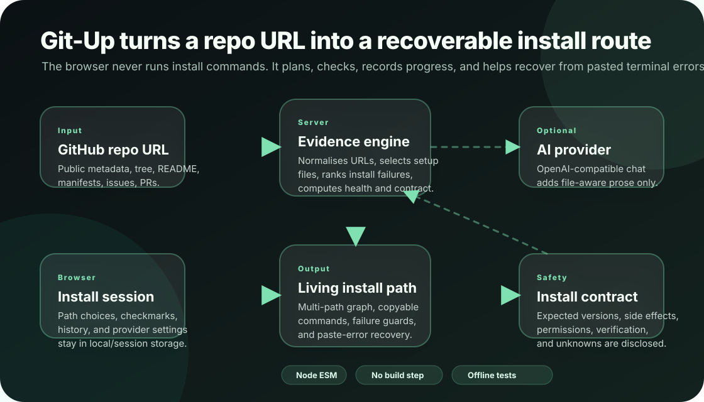

# Git-Up architecture

Git-Up is a small Node.js application that serves a vanilla JavaScript single-page interface and a JSON API. There is no build step, database, queue, or npm runtime dependency.

```text
Browser SPA (public/app.js)
  ├─ asks the local server to analyze a public GitHub URL
  ├─ stores local history, checked steps, and AI provider settings in browser storage
  ├─ recomposes path-graph choices client-side with public/path-engine.js
  └─ sends pasted failure output back to /api/recover when a step fails

Node HTTP server (server.js)
  ├─ serves public/ and selected root assets/ files
  ├─ reads public GitHub metadata, tree entries, raw setup files, issues, and PRs
  ├─ optionally sends scanned public file excerpts to a user-supplied AI provider
  ├─ computes health, failure signatures, graph variants, and install contract
  └─ returns guide/recovery JSON to the browser
```



Text-only workflow:

1. A user enters a public GitHub repository URL.
2. `server.js` normalises the URL and reads setup-related public repository data through GitHub.
3. Local parsers build a baseline guide even when no AI provider is configured.
4. Optional AI review can improve explanation text through a user-supplied OpenAI-compatible endpoint.
5. The browser renders a living checklist, graph choices, failure evidence, health score, and install contract.
6. The user runs commands in their own terminal. Git-Up never runs install commands.
7. If a step fails, the user pastes terminal output and `/api/recover` returns corrected steps for the remaining path.

## Runtime modules

| Area | File(s) | Notes |
| --- | --- | --- |
| HTTP server and GitHub access | `server.js` | Uses Node's built-in `http` module and global `fetch`. Static routes serve `public/` plus `/assets/*` from the root `assets/` directory. |
| Failure-first analysis | `server/failures.js` | Scores recent issues/PRs/discussions when available and falls back to clearly-labelled file inference. |
| Repository health score | `server/health.js` | Computes a 0-100 install-health score from documentation, reproducibility, freshness, failure pressure, and default-branch CI signals. No model is used. |
| Multi-path graph | `server/pathgraph.js` | Derives install variants such as platform, Docker/native, workspace scope, and dev/prod target from repository files. |
| Install contract | `server/contract.js` | Builds a digest-bound summary of expected versions, side effects, permissions, verification command, guarantees, and unknowns. |
| Recovery engine | `server/recovery.js` | Matches pasted error text against deterministic rules, with optional AI refinement over scanned public files. |
| Shared path composition | `public/path-engine.js` | Imported by both server and browser so the displayed checklist and generated install script use the same ordering/key logic. |
| Browser UI | `public/app.js`, `public/styles.css`, `public/magic.css`, `public/magic.js`, `public/particles-workspace.js`, `public/topbar-contributions.js` | Renders from string templates and re-binds events after each render. Accessibility affordances include skip link, dialog roles, keyboard palette, focus traps, and reduced-motion handling. |
| Tests | `tests/*.test.mjs` | Offline `node --test` coverage for path composition, health, contract, failure clustering, recovery, rendering, persisted sessions, and UI markup. |

## API boundaries

- **GitHub:** Git-Up reads public repository metadata, trees, raw setup files, issues, pull requests, and optionally discussions. Discussions require a server-side `GITHUB_TOKEN` because they are GraphQL-only.
- **AI provider:** Optional. The browser stores provider settings in `sessionStorage`; the API key is sent to the local Git-Up server for the current request and proxied to the configured provider. The server does not persist the key.
- **Installer commands:** Git-Up only displays and exports commands. It does not execute commands from analyzed repositories.
- **Local persistence:** Browser `localStorage` keeps analysis history and checked progress. Browser `sessionStorage` keeps AI provider settings for the session.

## Design constraints

- Keep the app dependency-light: add npm packages only when the value outweighs the maintenance cost.
- Keep server and browser path composition shared through `public/path-engine.js`.
- Label inferred findings as inferred. Reported GitHub threads and direct file parses must remain distinguishable in UI and API payloads.
- Never ask users to paste secrets into Git-Up. If logs may contain secrets, tell users to redact before sharing publicly.
- Make every README command match `package.json` scripts and the actual server entry point.

## Change checklist for future maintainers

Before changing user-visible behaviour:

1. Update or add focused tests under `tests/`.
2. Run `npm ci`, `npm test`, and `npm run smoke`.
3. If a route, environment variable, public asset, or script changed, update `README.md` and this file.
4. If an asset was added or replaced, update `docs/ASSETS.md` with source, license, modifications, and attribution.
5. Verify the app starts with `npm start` and that `/api/health` returns `{ ok: true }`.
